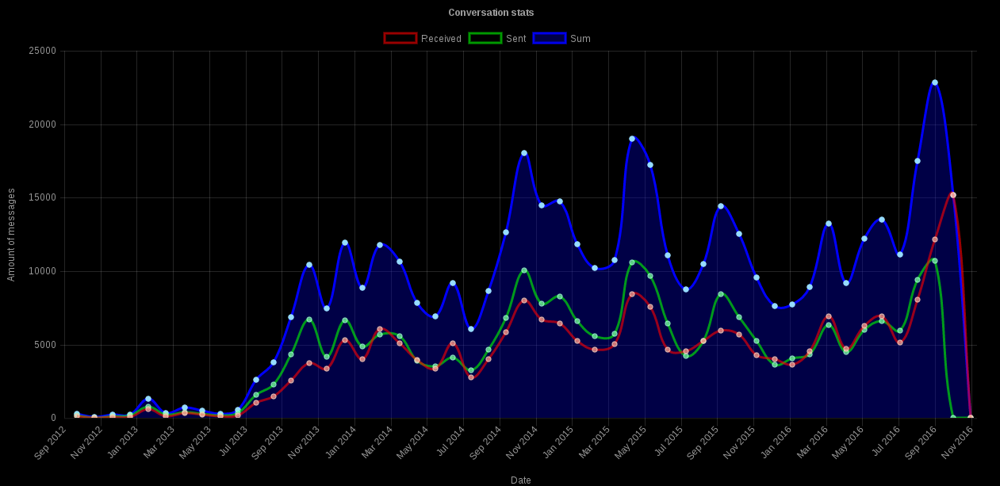
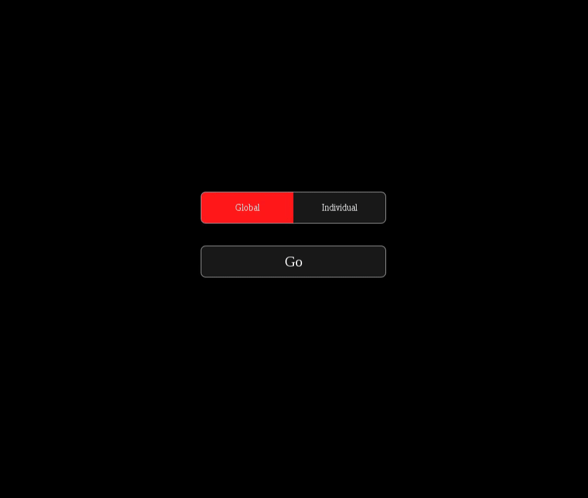

# facebook-backup-tools
Wonder how many messages you have written on facebook? Maybe you like looking at charts? With this tools you can do this, and many more!
Before using server.js you need to install nodejs module called `websocket`
You also need module called `progress` :)

# Parsing
Download copy of your data from facebook, unzip, and place `messages.htm` in the same directory as `parse_to_JSON.js` and run js file using node. It will generate `parsed.json`, which will contain all your conversations parsed to JSON format. More functions coming soon!

# Viewing numbers and charts
Before you start, you have to enter your full name which you use on facebook in file `your.name`, so that app will know which messages are written by you.
After parsing messages you can launch server.js, which will allow you to view stats about your messaging. Currently website is in alpha++ stage, and it will change a lot soon.
If you want to use it, enter `localhost:8097` and fill form with participant names and interval value. You can also display messages per hour stats using button on top of the page. Below chart there are two tables, one with detailed stats per conversation and second with most popular words in your conversations. You can also display particular messages, but don't use it now, because it's really bad :)

# Frontpage
Frontpage is under development, but it shows more or less how frontend is going to look. So far you can enter frontpage and play with buttons and textbox with some random completions (names and surnames are hardcoded, but they are random).

