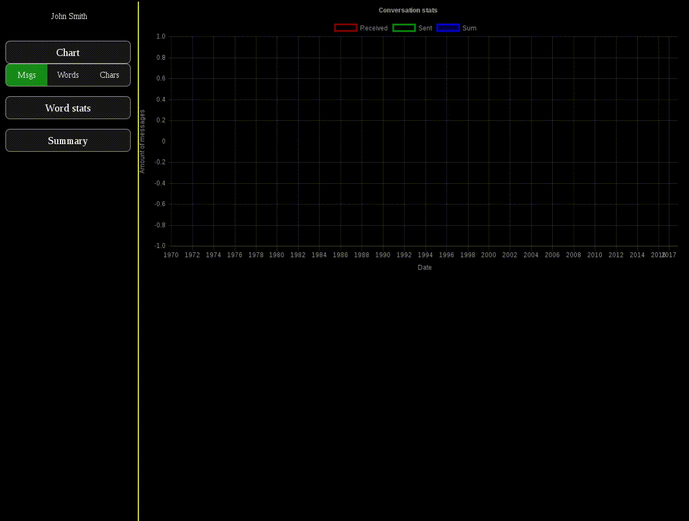

# facebook-backup-tools
Wonder how many messages you have written on facebook? Maybe you like looking at charts? With this tools you can do this, and many more!
Before using server.js you need to install nodejs module called `websocket`
You also need module called `progress` :)

# Parsing
Download copy of your data from facebook, unzip, and place `messages.htm` in the same directory as `parse_to_JSON.js` and run js file using node. It will generate `parsed.json`, which will contain all your conversations parsed to JSON format, and also some other files, which will be useful in future. More functions coming soon!

# Viewing numbers and charts
Before you start, you have to enter your full name which you use on facebook in file `your.name`, so that app will know which messages are written by you.
After parsing messages you can launch server.js, which will allow you to view stats about your messaging. Currently website is in alpha++ stage, and it will change a lot soon.
If you want to use it, enter `localhost:8097/frontpage.html` and enter conversation participants. Currently global stats are not supported. You will be moved to conversation page, where you can generate messages chart (more types coming soon), view most popular words in conversation, and read conversation.

# Frontpage
Frontpage is under development, but it shows more or less how frontend is going to look. Currnetly only individual stats are supported, but it supports completion :)

